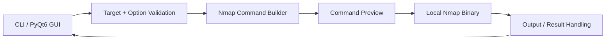

# Nmap Wrapper

<p align="center">
  <strong>Cross-platform Nmap command builder, execution wrapper and desktop GUI</strong><br/>
  CLI + PyQt6 • scan profiles • target validation • command preview • bilingual cheat sheets
</p>

<p align="center">
  
  
  
  
  
</p>
<p align="center">
  <a href="https://github.com/Danial-Zolfaghari/Nmap/actions/workflows/ci.yml"></a>
  <a href="https://github.com/Danial-Zolfaghari/Nmap/releases"></a>
  <a href="LICENSE"></a>
</p>


---

## Overview

This project wraps the local **Nmap** executable with a Python CLI and PyQt6 GUI to make repeatable authorized scanning easier to configure, preview and document.

It does not bundle Nmap. The official Nmap binary must be installed separately.

## Platform support

| Platform | CLI | GUI | Notes |
|---|---:|---:|---|
| Linux | ✅ | ✅ | Nmap package + Python 3.10+ |
| Windows 10/11 | ✅ | ✅ | Install official Nmap/Npcap package |
| macOS | ✅ | ✅ | Install Nmap, e.g. Homebrew |

Some Nmap scan types require elevated/root privileges on every platform.

## Architecture



## Included components

- `nmap_wrapper.py` — terminal wrapper / command builder
- `nmap_wrapper_gui.py` — PyQt6 desktop GUI
- English + Persian Nmap cheat sheets
- English + Persian schematic references
- GUI documentation

## Requirements

### System

- Nmap installed and available in `PATH`
- Python **3.10+**
- Administrator/root privileges for scan modes that require raw sockets

### Python

```text
colorama>=0.4.6
PyYAML>=6.0
PyQt6>=6.7
```

## Install Nmap

Linux examples:

```bash
sudo apt install nmap       # Debian / Ubuntu
sudo dnf install nmap       # Fedora
sudo pacman -S nmap         # Arch
```

macOS:

```bash
brew install nmap
```

Windows: install from the official Nmap distribution at <https://nmap.org/download.html>.

## Install Python dependencies

```bash
python -m venv .venv
```

Linux / macOS:

```bash
source .venv/bin/activate
pip install -r requirements.txt
```

Windows PowerShell:

```powershell
.\.venv\Scripts\Activate.ps1
pip install -r requirements.txt
```

## Run

CLI:

```bash
python nmap_wrapper.py --help
```

GUI:

```bash
python nmap_wrapper_gui.py
```

## Documentation

| Document | Language | Purpose |
|---|---|---|
| `Nmap_CheatSheet_EN.md` | English | Nmap reference / examples |
| `Nmap_CheatSheet_FA.md` | Persian | Nmap reference / examples |
| `Nmap_Schematic_EN.md` | English | Conceptual scan diagrams |
| `Nmap_Schematic_FA.md` | Persian | Conceptual scan diagrams |
| `README_GUI.md` | English | GUI-specific guide |

## Responsible use

Only scan hosts, networks and services you own or have explicit permission to test. Some Nmap techniques can trigger IDS/IPS alerts, service logs or rate limits.

## Author

**Danial Zolfaghari** — [@Danial-Zolfaghari](https://github.com/Danial-Zolfaghari)
